# kds-demo
# Tech stack
React - javascript/html5/css
Python -  Flask

python3 -m venv .venv && source .venv/bin/activate
pip install -r requirements.txt
python app.py
# Open the KDS screen in your browser:
# http://localhost:5000 - or start with 5001 on macos

In a different terminal, send a test order:

# on macos:
curl -X POST http://localhost:5001/api/order -H 'Content-Type: application/json' -d '{ "order_id":"A123", "source":"Web", "table":"5","items":[ {"name":"Taco al Pastor","qty":2,"mods":["no cheese","extra salsa"]}, {"name":"Churros","qty":1} ] }'

# Open a new / different browser and resend the a test order with a different order_id. You will see both browsers reflect the order and status

to get feedback from a transaction:
stripe listen --forward-to localhost:5001/webhook/stripe

# Screen shots of Interfaces and backend processing:

A screenshot of the project interface across multiple screens 
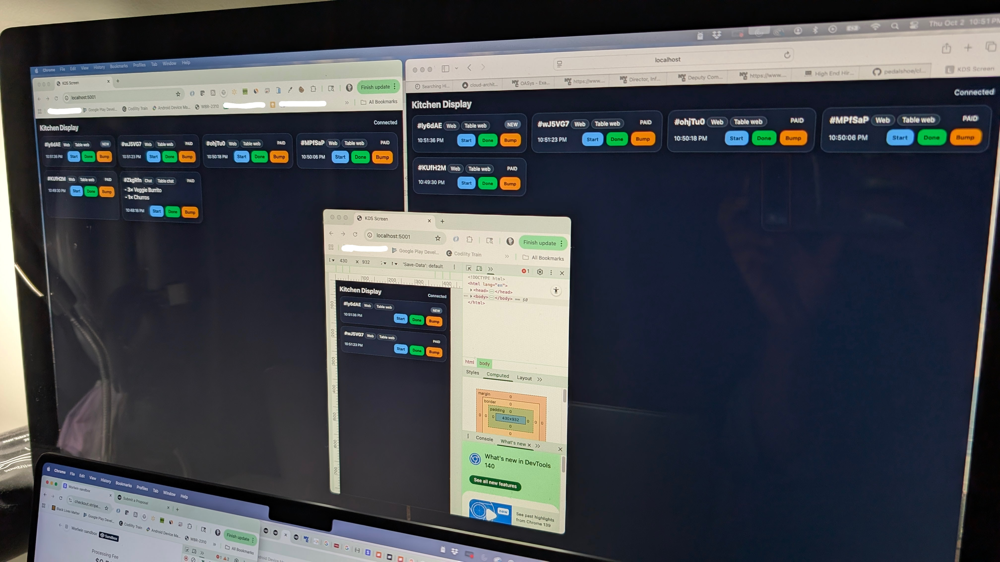

Mobile view of screen 
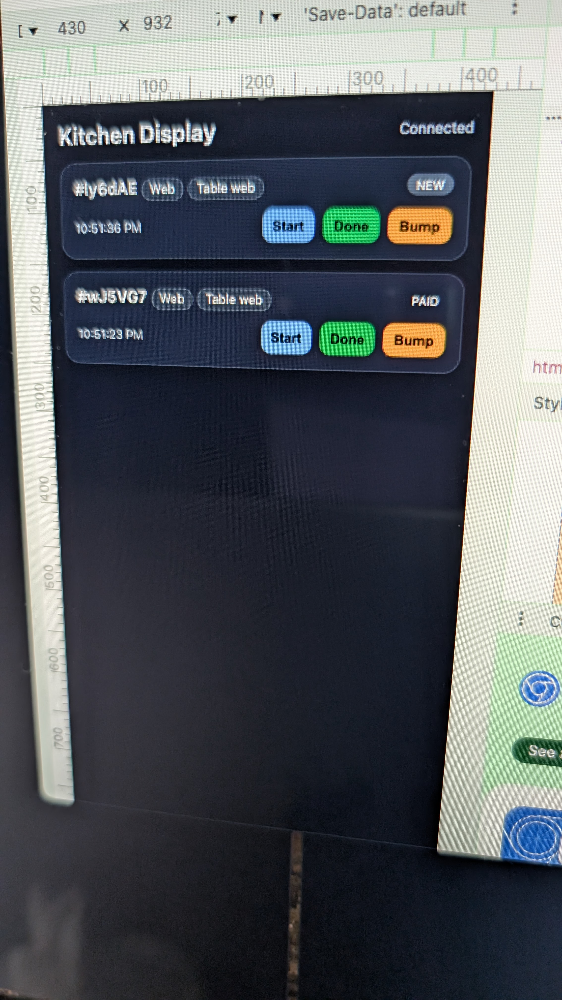

A screenshot of the project interface 
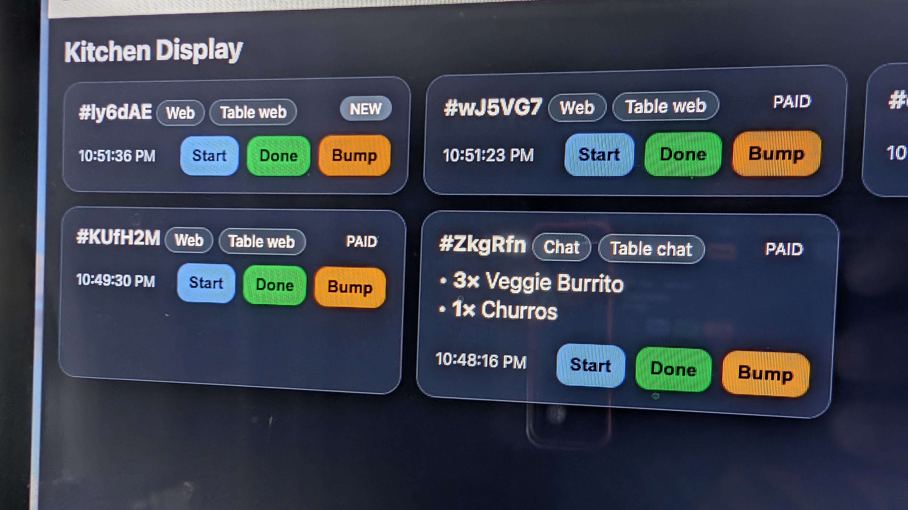

Multiple orders 
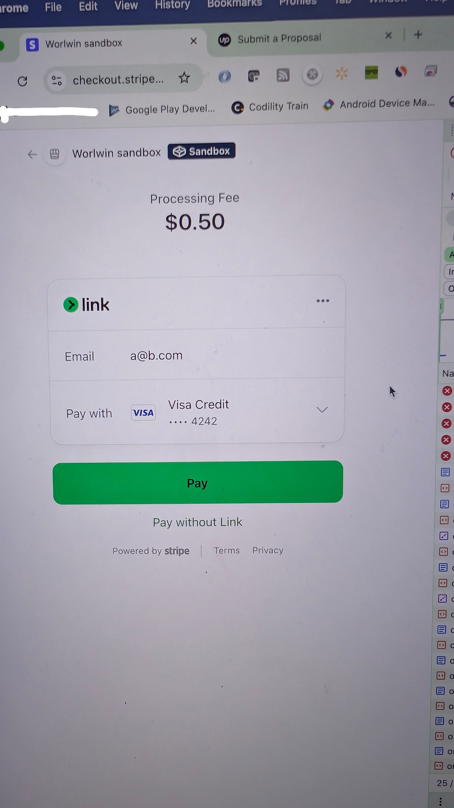

Stripe backend 
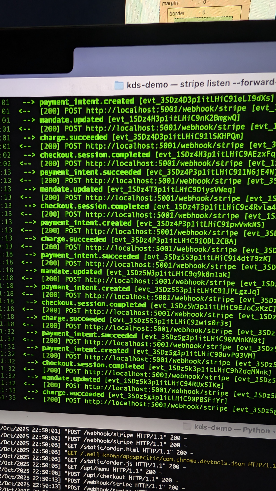 
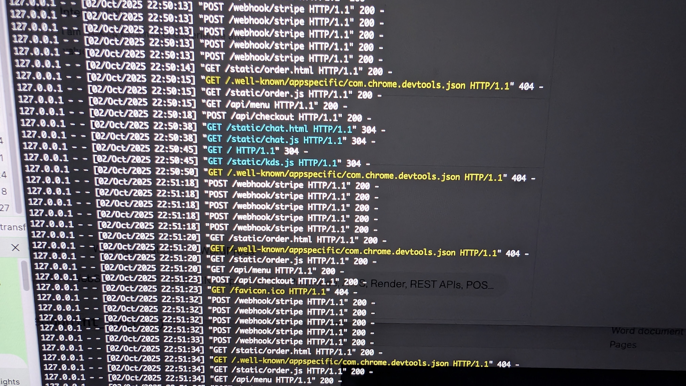

The Chatbot interface for taking orders 
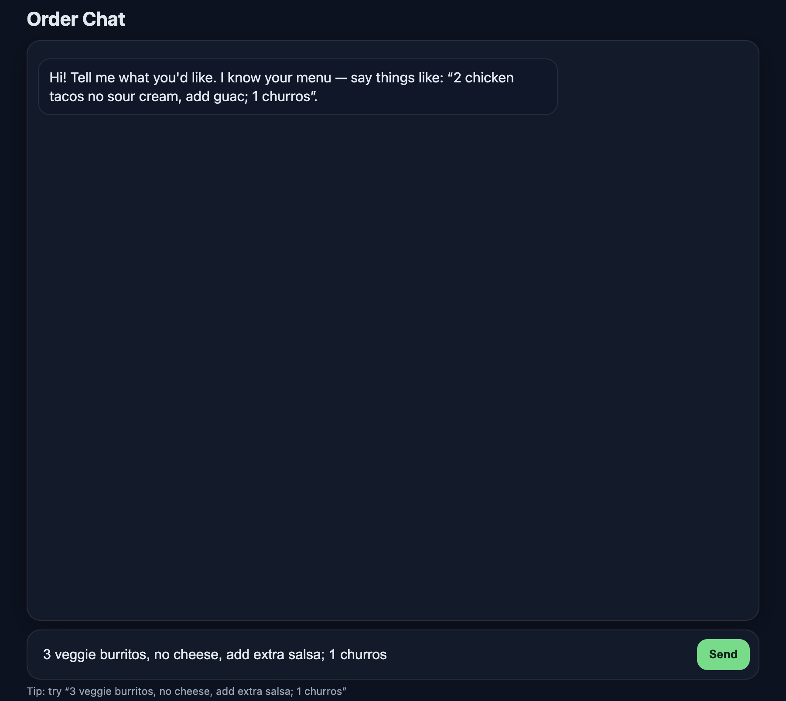

Stripe listener 
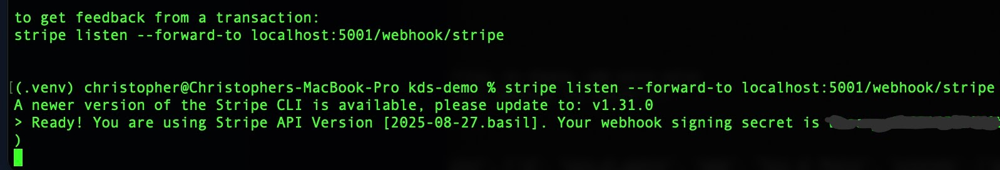

Chatbot order screen 
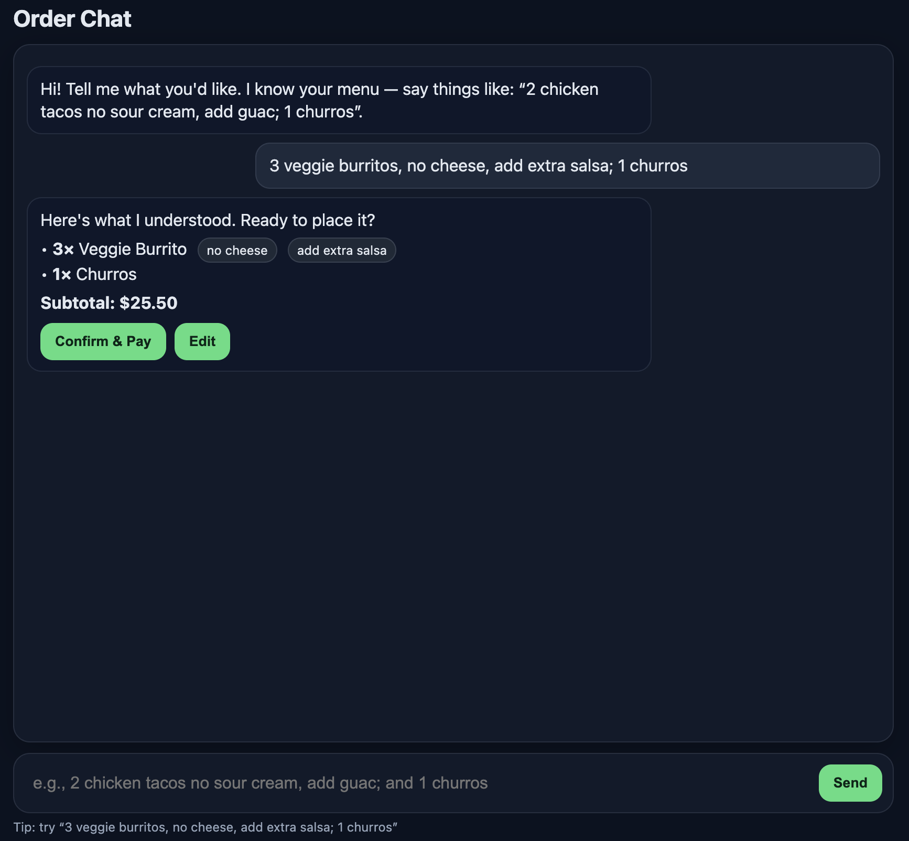

Web interface for taking orders 
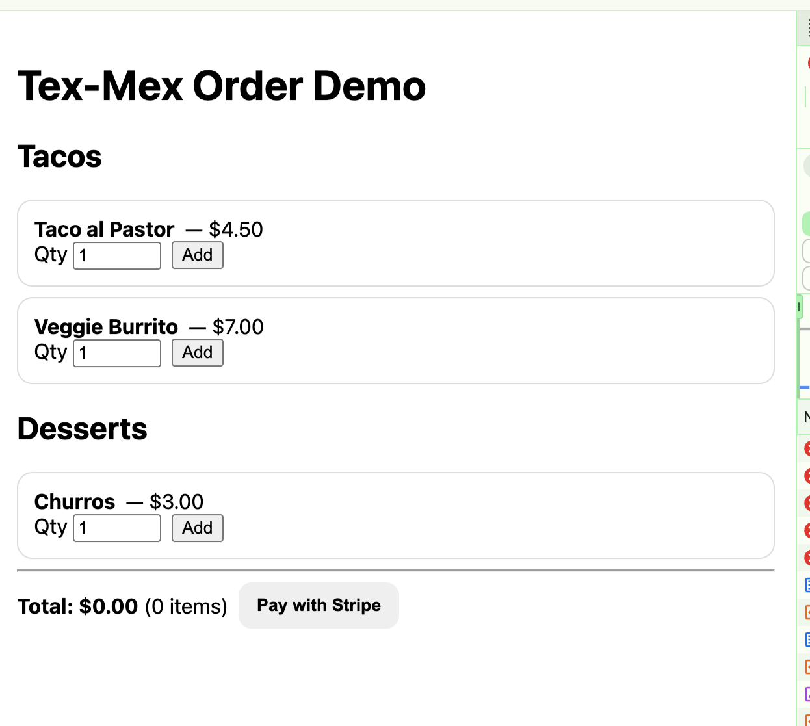

Mobile device screen 
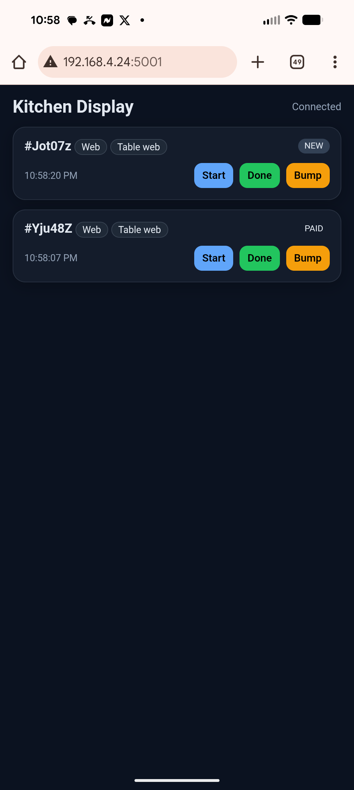

