# kds-demo

# Tech Stack - llm integration
 - Two Ollama models routing correctly
 - RAG retrieving menu context
 - Intent classification
 - Structured order extraction
 - n8n automation firing
 - Slack notifications
 - Docker production stack
 - pytest suite

# With Docker Run
docker compose up -d

# Check both models and latency
curl http://localhost/api/llm/health | python3 -m json.tool

# RAG vectorstore - confirm menu is indexed
curl http://localhost/api/rag/stats | python3 -m json.tool

# Test mistral + RAG (question intent)
curl -X POST http://localhost/api/llm/chat \
  -H "Content-Type: application/json" \
  -d '{"text": "do you have any vegetarian options?"}' | python3 -m json.tool

# Test llama3 (order intent)
curl -X POST http://localhost/api/llm/chat \
  -H "Content-Type: application/json" \
  -d '{"text": "I would like two tacos al pastor please"}' | python3 -m json.tool

# Test full order flow through chat + n8n notification
curl -X POST http://localhost/api/chat \
  -H "Content-Type: application/json" \
  -d '{"text": "two tacos al pastor and one agua fresca"}' | python3 -m json.tool

# bring up n8n automation interface:
In a new browser window: Browse to: http://localhost:5678

# bring up a window to show the KDS ordering interface:
In a new browser window, Browse to: http://localhost:5001

# bring up the KDS
In a new browser window, Browse to: http://localhost:5001/static/kds.html

# Without Docker Run

# Tech stack - Orignal
React - javascript/html5/css
Python - Flask

React Startup and demo
python3 -m venv .venv && source .venv/bin/activate
pip install -r requirements.txt
python app.py
# Open the KDS screen in your browser:
# http://localhost:5000 - or start with 5001 on macos

In a different terminal, send a test order:

# on macos:
curl -X POST http://localhost:5001/api/order -H 'Content-Type: application/json' -d '{ "order_id":"A123", "source":"Web", "table":"5","items":[ {"name":"Taco al Pastor","qty":2,"mods":["no cheese","extra salsa"]}, {"name":"Churros","qty":1} ] }'

# Open a new / different browser and resend the a test order with a different order_id. You will see both browsers reflect the order and status

to get feedback from a transaction:
stripe listen --forward-to localhost:5001/webhook/stripe

# Screen shots of Interfaces and backend processing:

A screenshot of the project interface across multiple screens 
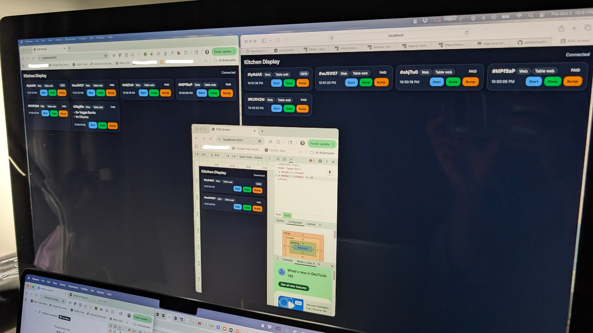

Mobile view of screen 
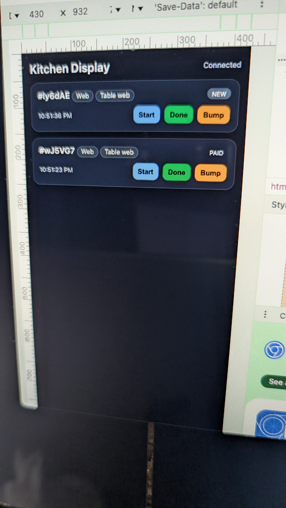

A screenshot of the project interface 
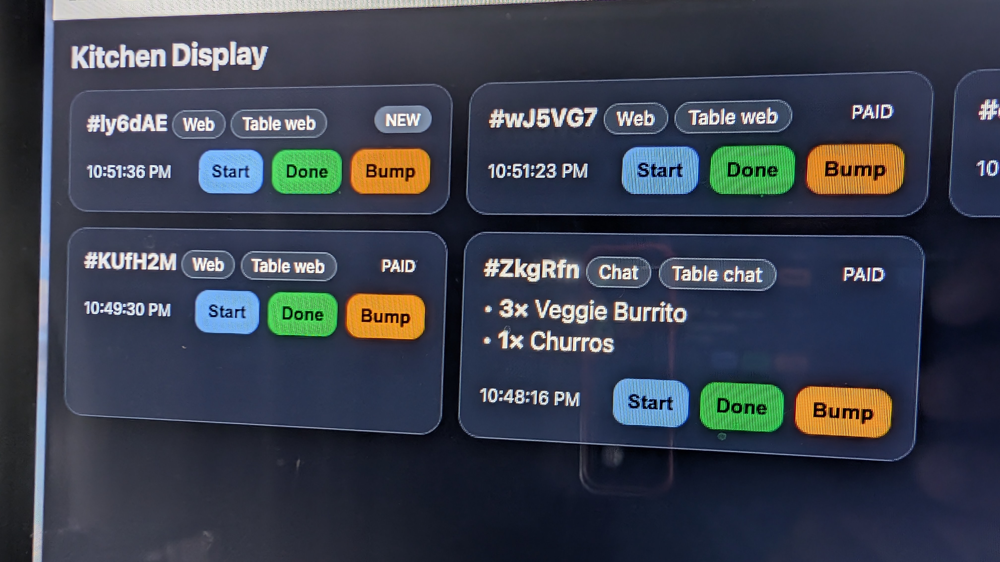

Multiple orders 
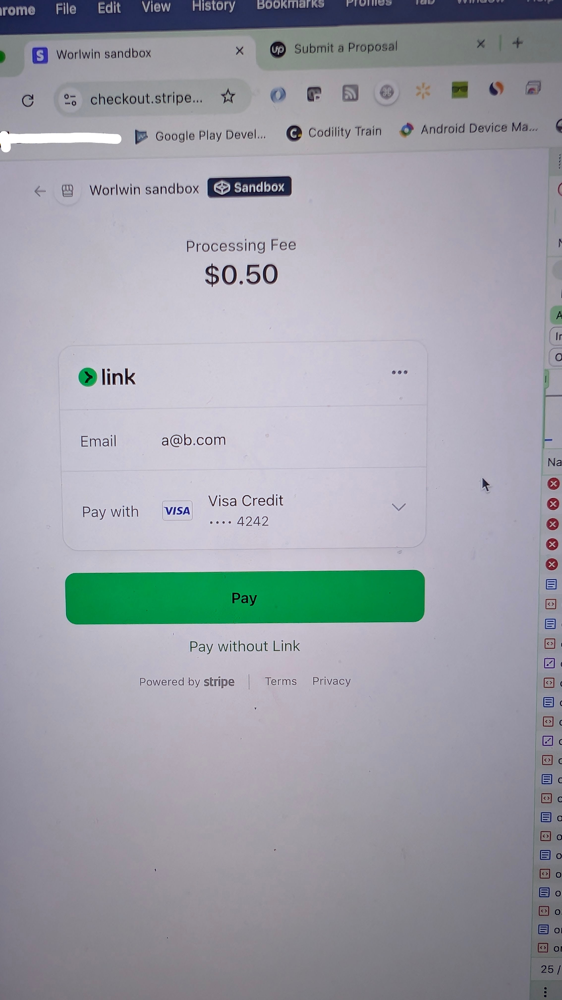

Stripe backend 
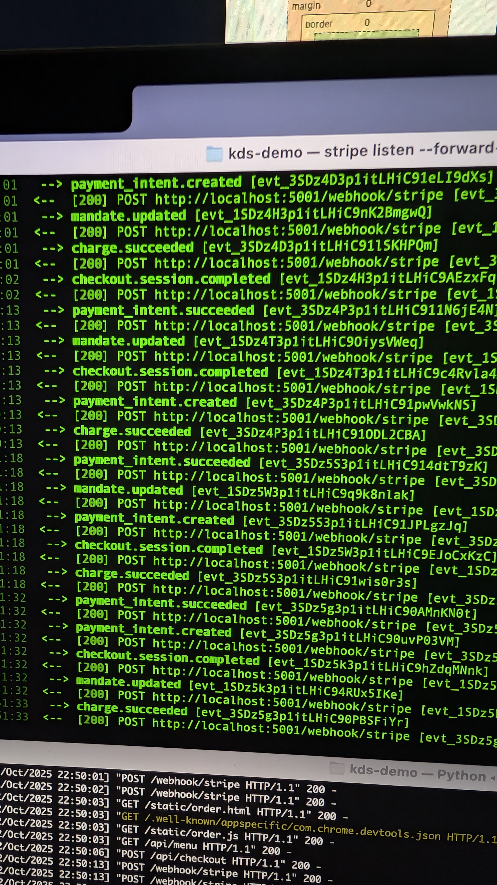 
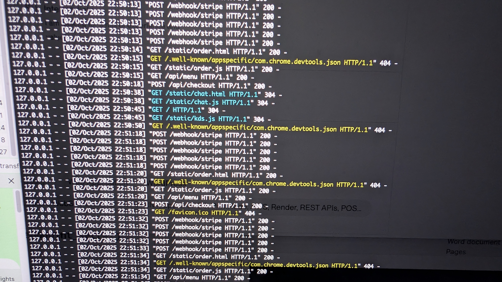

The Chatbot interface for taking orders 
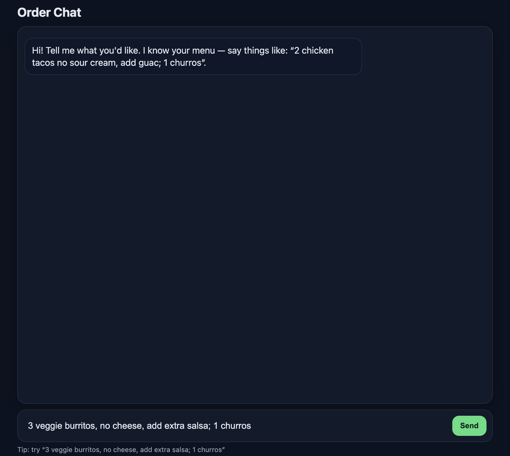

Stripe listener 
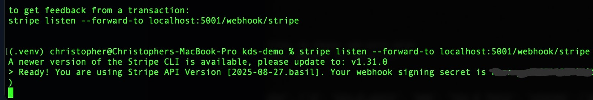

Chatbot order screen 
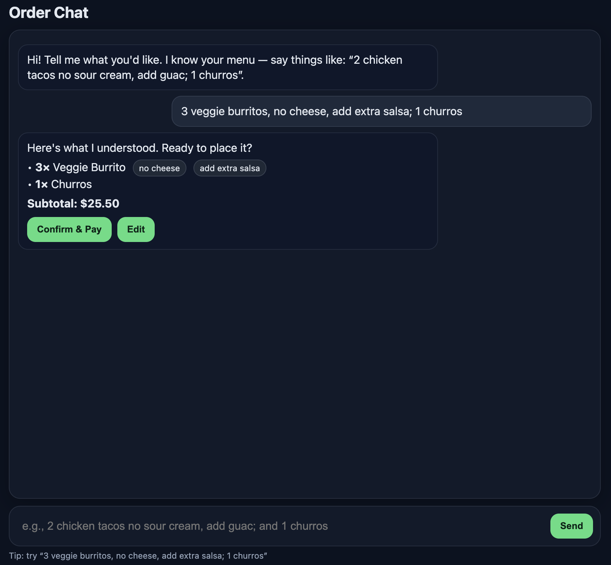

Web interface for taking orders 
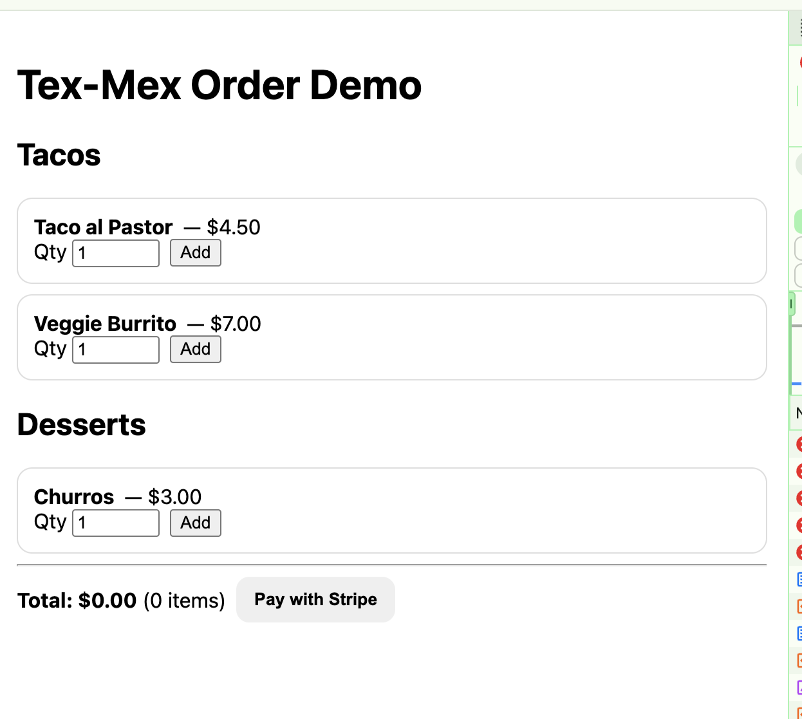

Mobile device screen 
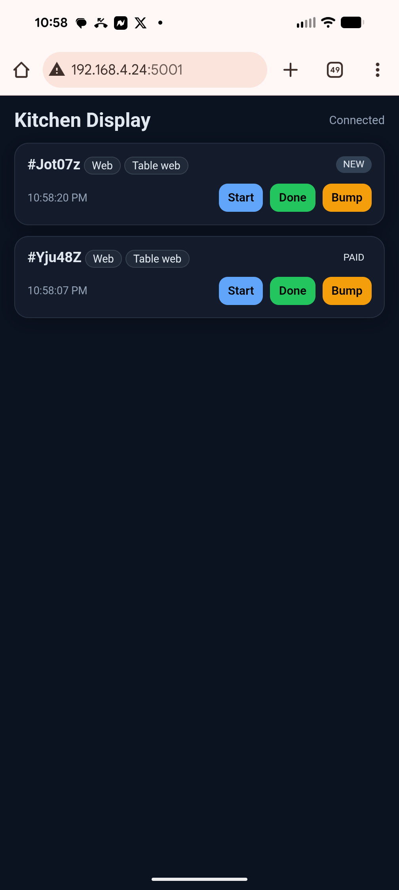

